# Mass Spectrometer Interface Design

cousins-lab-tools · WSU Cousins Plant Biology Lab · design views derived from the code on `main` at 30a3fc4

1. [High-level design](#s1)
2. [Data flow diagrams](#s2)
3. [Data model](#s3)
4. [Domain model](#s4)
5. [Program design (LLD)](#s5)
6. [Module dependency graph](#s6)
7. [Program flow](#s7)
8. [High-level design graph](#s8)
9. [Onboarding views](#s9)

## 1. High-level design

### 1.1 Purpose and scope

Desktop tooling for viewing, calibrating and logging mass spectrometer data used in plant respiration experiments. Four modules ship: three are copies of one PyQt5 acquisition viewer that differ only in which channels they draw and which derived quantity they compute; the fourth converts the secondary spectrometer's EZView spool file into the per-frame CSV format the viewers read. Audience: the students maintaining the code and the lab staff running it.

### 1.2 System context

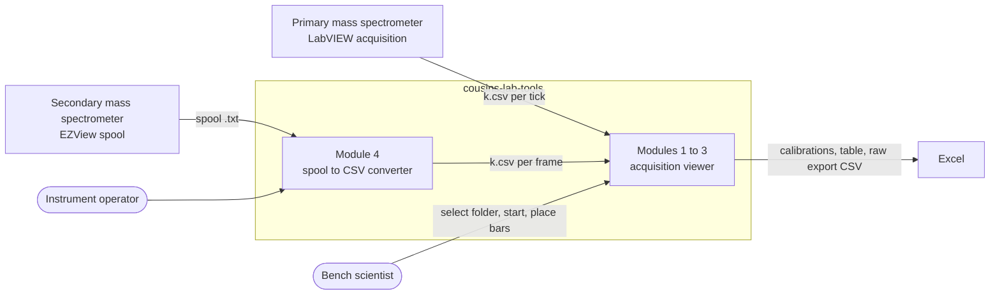

Figure 1.1 System context. The only integration point between instrument side and viewer side is a folder of CSV frames.

### 1.3 Component architecture

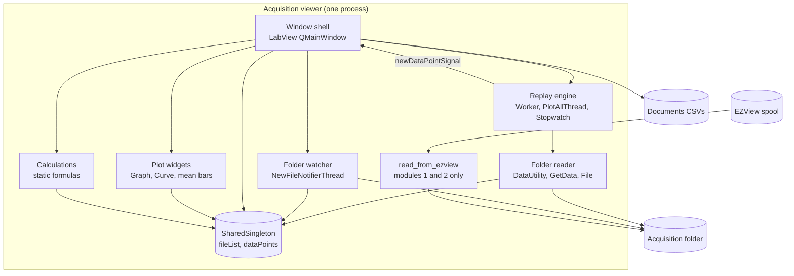

Figure 1.2 Components inside one viewer instance and the files it touches.

### 1.4 Technology stack

Technology stack

| Concern | Choice | Notes |
| --- | --- | --- |
| Language | Python 3 | README says 3.1+; code uses f-strings, so 3.6+ in practice |
| GUI | PyQt5 | QMainWindow, QThread, signals and slots |
| Plotting | pyqtgraph | PlotWidget, PlotDataItem, LinearRegionItem for the mean bars |
| File watching | watchdog | Observer on the acquisition folder |
| Data | pandas, numpy | read_csv per frame; polyfit for module 3 slope |
| Packaging | PyInstaller | one `main.spec` per module, output in git-ignored `dist/` |
| Storage | CSV files | no database |
| Module 4 picker | tkinter | hidden root plus file dialog |

### 1.5 Components, inputs and outputs

Components, inputs and outputs

| Component | Input | Output | Files |
| --- | --- | --- | --- |
| Folder reader | folder path; fileList index | (x, \[y0…y7\]) or False | `read-data/` |
| Folder watcher | filesystem create events | appended fileList entries | `mainUI/newFileNotifierThread.py` |
| Replay engine | stopwatch time; reader tuples | batches of tuples via Qt signal; end-of-data signal | `mainUI/worker.py`, `plotAllThread.py`, `stopwatch.py` |
| Window shell | signals; button clicks; line-edit text | dataPoints writes; widget updates; CSV files | `mainUI/main.py` |
| Plot widgets | x keys from singleton; y lists | rendered curves | `uiElements/` |
| Calculations | dataPoints, window bounds, scalars | floats | `calculations/Calculations.py` |
| Spool converter | spool .txt | Acquisitions/AcquisitionN/k.csv | `module4/application/main.py`, `read-data/readEZView.py` |

### 1.6 Module variants

Module variants

|  | Module 1 | Module 2 | Module 3 |
| --- | --- | --- | --- |
| Curves drawn | all 8 masses | m32, m44, uBar, D\[uBar\] | m45, m47, m49, atom49%, D\[atom49%\] |
| Per-frame derived value | none | µbar CO2 = 9200 · cal · (m44 − zero); D = previous − current | ln(100 · m49 / (m45 + m47 + m49)); slope of last 15 points |
| Calibration inputs | 12: temp, O2 cal, O2 zero, BiCarb/CO2, CO2 0/6/12/18 µL, BiCarb 0/2/4/6 µL | CO2 volt, CO2 zero, CO2 sample, O2 temp, O2 zero, O2 average | CO2 0/1/2/3 µL, CO2 zero, CO2 sample |
| Table row | vO, vC, \[CO2\], \[O2\] | %CO2, µbar CO2, µbar O2 | atom%49 mean |
| Spool import | yes | yes | no |
| Extra singleton stores | — | — | a49data, da49data |

### 1.7 Constraints and assumptions

- Output paths are hard-coded to `C:\Users\<login>\Documents\…`; Windows only as written.
- Frames arrive as one CSV file each, natural-sortable by name; the first frame read defines the time origin.
- Column order in a frame is fixed: time_ms then m32, m34, m36, m44, m45, m46, m47, m49.
- One viewer instance reads one folder; there is no concurrent multi-folder use.
- `module3/main.py` at the module root is a stale merge of modules 2 and 3; the canonical module 3 entry point is `module3/application/mainUI/main.py`.

## 2. Data flow diagrams

Gane–Sarson conventions: processes are numbered rounded boxes, data stores are labelled D*n*, external entities are plain boxes.

### 2.1 Level 0 (context)

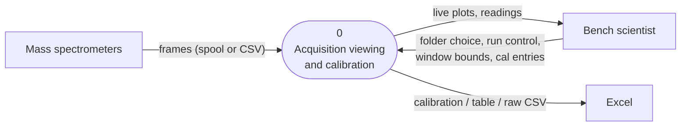

Figure 2.1 Level 0.

### 2.2 Level 1

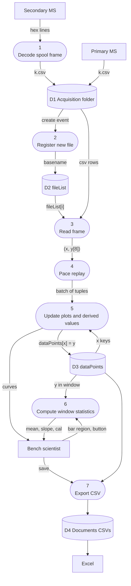

Figure 2.2 Level 1. Process 4 is the Worker timer or the PlotAllThread drain; process 5 is `update_plot_data` on the main thread.

### 2.3 Data flow dictionary

Data flow dictionary

| Flow | Structure | From → To |
| --- | --- | --- |
| hex lines | "MM/DD/YY HH:MM:SS.ffffff" TAB hex, frame ends at `ffffffff` | Secondary MS → 1 |
| k.csv | one row: time_ms, ch5, ch2, ch4, ch3, ch1, ch6, ch7, ch8 (no header) | 1 or Primary MS → D1 |
| basename | "k.csv" | 2 → D2 |
| (x, y\[8\]) | x seconds since first frame; y column means | 3 → 4 |
| batch of tuples | list of (x, y\[8\]) emitted by `newDataPointSignal` | 4 → 5 |
| bar region | (xleft, xright) from `meanBar.getRegion()` | Scientist → 6 |
| mean, slope, cal | rounded floats to line edits | 6 → Scientist |

## 3. Data model

There is no database. Persistent data is CSV with fixed column order; runtime data is dictionaries on one singleton. The ER diagram treats each file type and each in-memory structure as an entity.

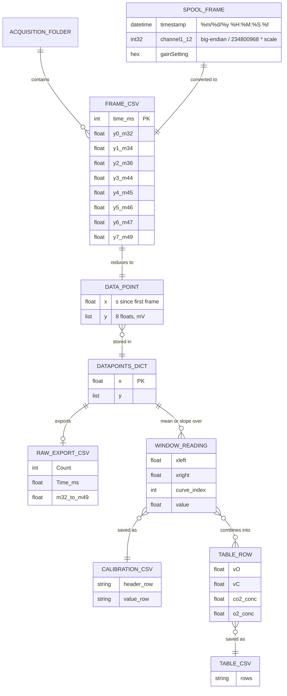

Figure 3.1 Entity–relationship view of files and runtime structures. TABLE_ROW columns shown for module 1.

### 3.1 Data dictionary

Data dictionary

| Entity | Field | Type | Rule |
| --- | --- | --- | --- |
| Spool frame | timestamp | datetime | first tab field of the first line; last 4 chars dropped before parse |
|  | channel n | int32 → float | hex slice \[8n−7 : 8n\], big-endian, ÷ 234800968, × scale (0.2, 20, 20, 0.1, then 1.0) |
|  | gainSetting | hex | slice \[97:\], dropped on write |
| Frame CSV | col 0 | int | ms since converter start (module 4) or LabVIEW timestamp |
|  | col 1…8 | float | after dropping ch9, ch10, gain and swapping ch1↔ch5, ch3↔ch4 |
| DataPoint | x | float | last row time ÷ 1000 − initialX |
|  | y | list\[8\] | column means of the file, column 0 removed |
| SharedSingleton | fileList | list\[str\] | natural sort on first listing; appended by watcher |
|  | dataPoints | dict\[float, list\] | insertion order equals time order |
|  | folderAccessed, initialX, xPoint | bool, float, float | set on first read |
|  | a49data, da49data | dict | module 3 only |
| Calibration CSV | row 1 | strings | m1: Temp, O2 Calibration, O2 Buffer Zero, BiCarb/CO2, CO2 Cal 0/6/12/18, BiCarb Cal 0/2/4/6 · m3: CO2 0µL…3µL, CO2 Zero, CO2 Sample |
|  | filename | string | `%d-%m-%y %H-%M-%S.csv` under Documents/Calibrations |
| Table CSV | rows | strings | every table cell, no header, Documents/TableData |
| Raw export CSV | header | strings | Count, Time, m32, m34, m36, m44, m45, m46, m47, m49 |

## 4. Domain model

Conceptual view, independent of Qt and of the file layout. Attributes are what the lab reasons about; operations are the things a scientist asks for.

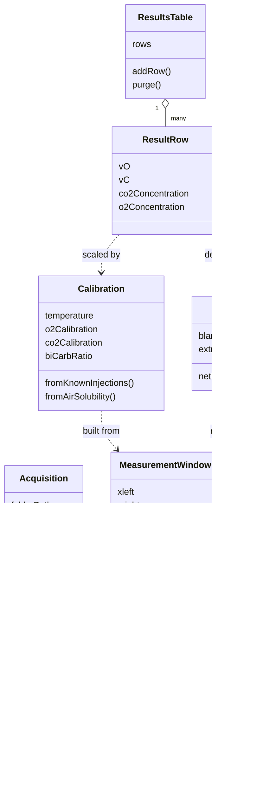

Figure 4.1 Domain model. Masses are 32, 34, 36, 44, 45, 46, 47, 49.

### 4.1 Domain rules

Domain rules

| Rule | Definition | Implemented in |
| --- | --- | --- |
| Time origin | elapsed = t_last_ms / 1000 − initialX, initialX taken from the first frame of the session | `File.__next__` |
| Window mean | mean of a mass over frames with xleft ≤ x ≤ xright, 4 dp; bounds snap to nearest frame; out of range → "undefined" | `Calculations.getMean` |
| O2 air solubility | −0.0018 T³ + 0.2229 T² − 12.387 T + 456.49 | `calculate02Calibration`, `calculateO2Air` |
| O2 calibration | solubility ÷ mean mV of air-equilibrated water; µbar O2 = O2cal × m32 mean | `calculateO2Cal`, `calculateUbarO2` |
| CO2 calibration (m1) | slope = Δconcentration ÷ ΔmV across cal points; intercept = c₀ − slope · mV₀ | `calculateSlope`, `calculateIntercept` |
| CO2 (m2) | %CO2 = cal × (m44 − zero); µbar = %CO2 × 9200 | `calculatePercentCO2`, `calculateUbarCO2` |
| Net rate and velocity (m1) | net = extract slope − blank slope; vO = −net × O2cal; vC = −net × CO2cal; \[CO2\] = CO2cal × (m44 − zero44) ÷ BiCarb ratio | `extractButtonPressed` |
| atom%49 (m3) | 100 × m49 ÷ (m45 + m47 + m49) with negatives clamped to 0; plotted as ln; rate = slope of linear fit over last 15 points | `calculateAtom49` |

## 5. Program design (LLD)

### 5.1 Class diagrams

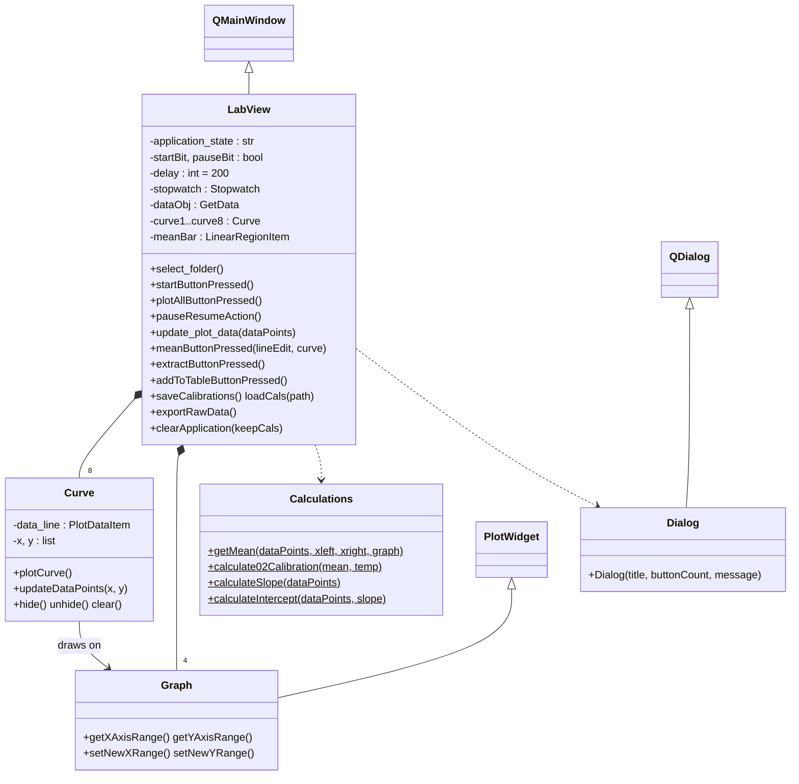

Figure 5.1a Window, widgets and formulas, as instantiated in module 1 (module 3 has three graphs). Frame, Button and LineEdit are trivial subclasses and are omitted. `$` marks static methods.

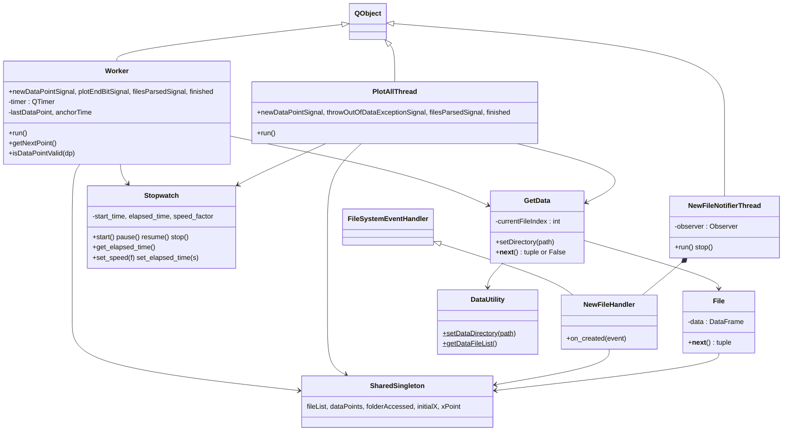

Figure 5.1b Replay, reading and watching. LabView creates a Worker per Start, a PlotAllThread per Plot All, and one NewFileNotifierThread after the first folder listing.

### 5.2 Sequence: Start and replay

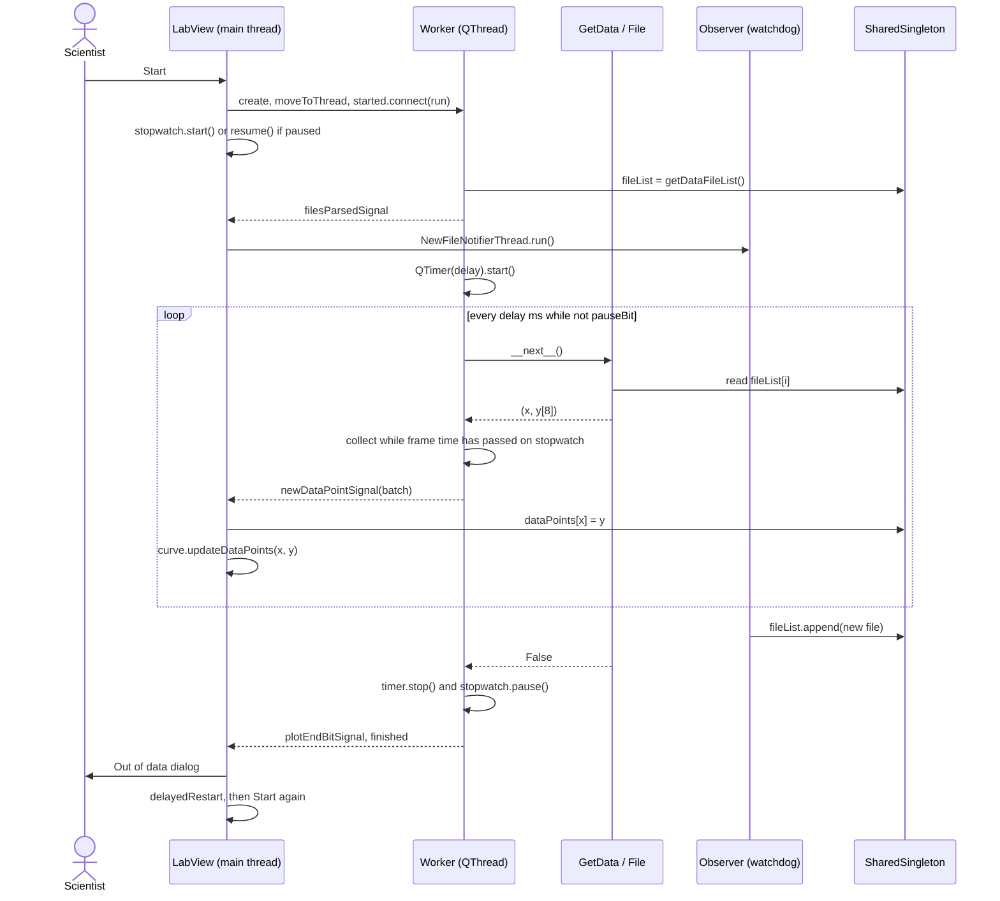

Figure 5.2 Replay. Pacing compares frame timestamps to the stopwatch, so a recording replays at its recorded rate times the speed factor.

### 5.3 Sequence: calibration point (module 1)

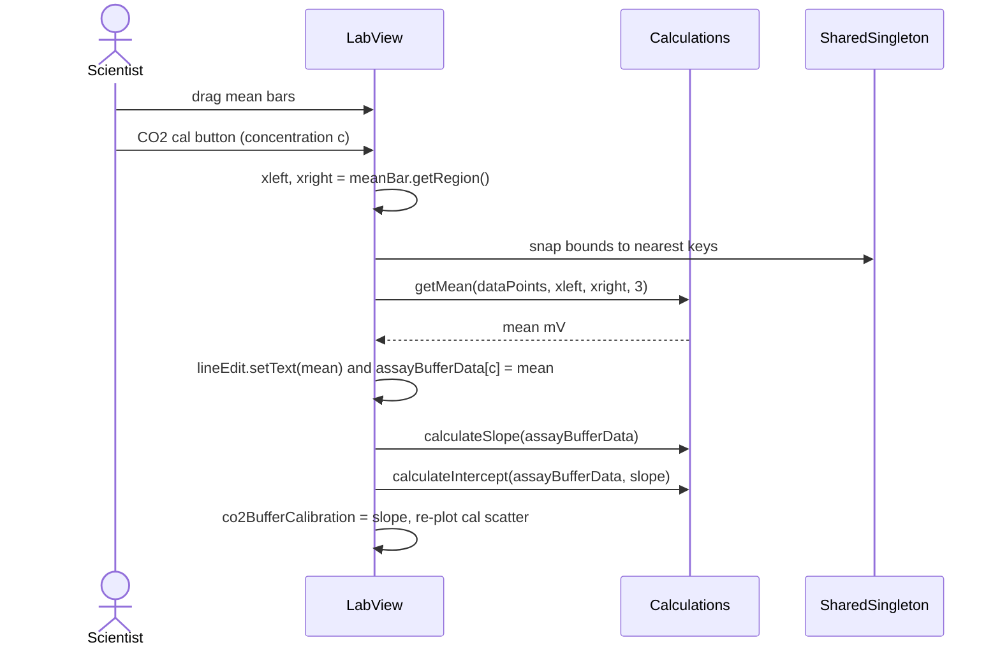

Figure 5.3 One calibration point. Extract and Blank follow the same shape with slope instead of mean.

### 5.4 Module descriptions

Module descriptions

| Module | Responsibility | Interface | Error handling |
| --- | --- | --- | --- |
| `mainUI/main.py` | Builds three scroll frames (raw plot, calculated plots, calculation panel and table); owns state and all slots | module-level: creates QApplication and LabView | Dialog subclass for every user-facing condition; undefined values written as text |
| `mainUI/worker.py` | Timed replay of frames | signals listed in 5.1; `run()`, `getNextPoint()` | False from reader → stop timer, emit plotEndBit |
| `mainUI/plotAllThread.py` | Drain all frames in one batch; fast-forward stopwatch | `run()` | Idle state → folder-not-selected signal; no data → out-of-data signal |
| `mainUI/newFileNotifierThread.py` | Watch folder, append new file names | `run()`, `stop()` | bare except stops observer |
| `mainUI/stopwatch.py` | Pausable wall clock with speed factor | start/pause/resume/stop/get_elapsed_time/set_speed/set_elapsed_time | no-ops on invalid transitions |
| `read-data/getData.py` | Cursor over fileList | `setDirectory(path)`, `__next__()` | returns False past end |
| `read-data/file.py` | One CSV → one (x, y) | `__next__()` | none; pandas errors propagate |
| `read-data/dataUtility.py` | chdir; natural-sorted listing | two static methods | none |
| `read-data/readEZView.py` | Tail spool, write frames | `read_from_ezview(folderPath, spoolPath)` | catch-all prints and exits loop |
| `calculations/Calculations.py` | Formulas | static methods | equal voltages → None; single point → 0 |
| `uiElements/curve.py` | One PlotDataItem | plotCurve, updateDataPoints, hide, unhide, clear | none |
| `module4/application/main.py` | Standalone spool → CSV | script; tkinter picker | catch-all prints and exits |

## 6. Module dependency graph

Three sibling folders are pushed onto `sys.path`, so every import is by bare module name. Edges from `main` to the fifteen application modules (fourteen in module 3, which lacks readEZView) are drawn once as a group edge to keep the graph readable.

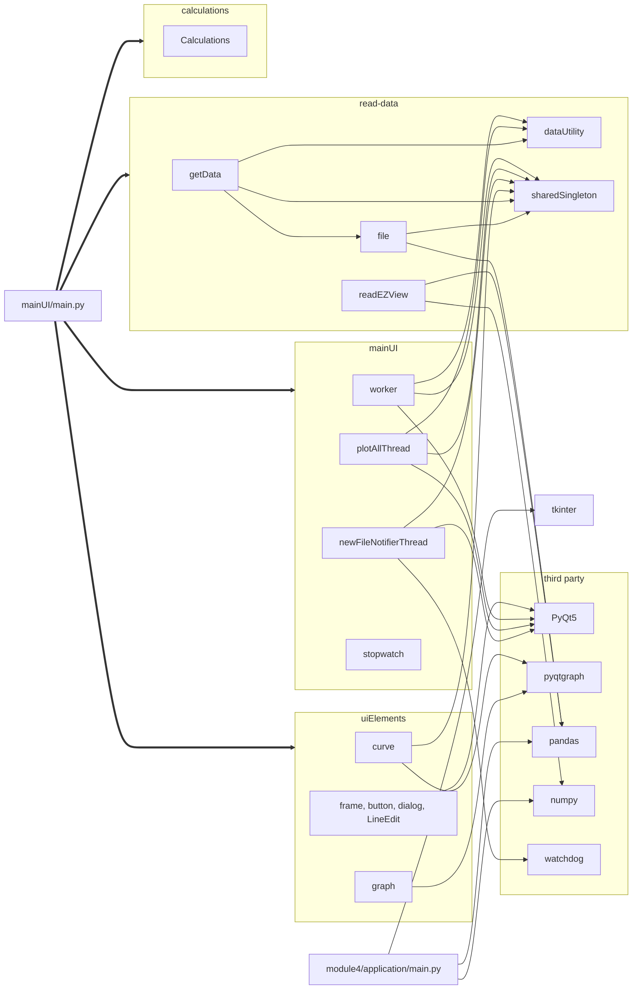

Figure 6.1 Import graph for one viewer instance plus module 4. `Calculations` imports only the standard library, which is why it is the one module with tests. Everything else funnels into `sharedSingleton`.

## 7. Program flow

### 7.1 Application state

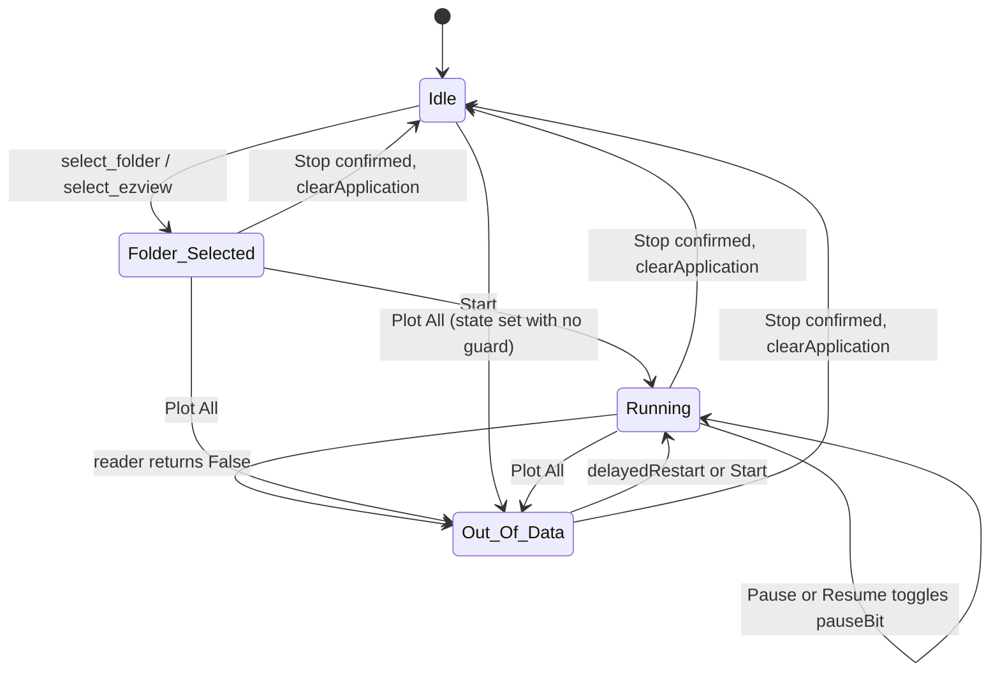

Figure 7.1 Values of `application_state` and the slots that change them.

### 7.2 Worker tick

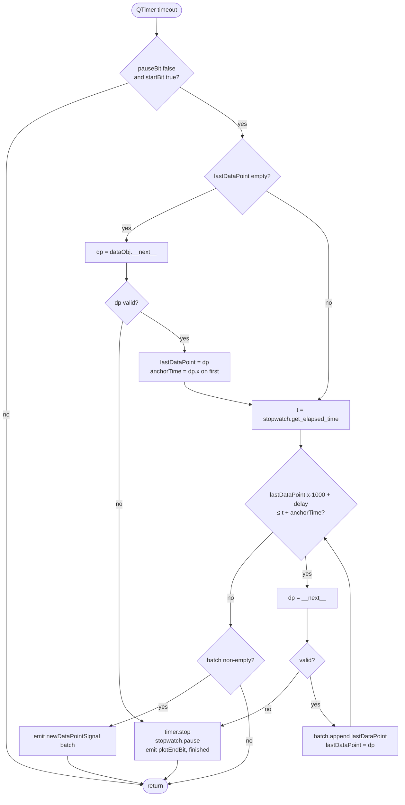

Figure 7.2 `Worker.getNextPoint`. The loop releases every frame whose recorded time has already passed on the stopwatch.

### 7.3 Measurement workflow (module 1)

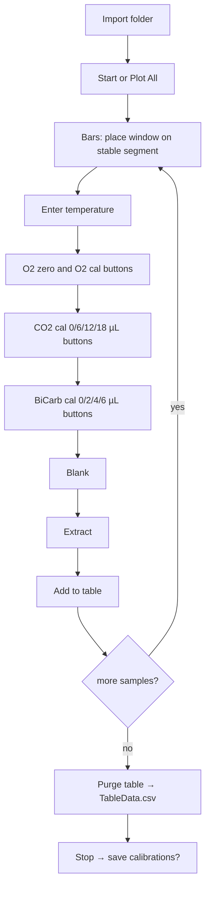

Figure 7.3 The order the panel expects. Each cal button reads the current window; Extract refuses to run until Blank and the calibrations exist.

## 8. High-level design graph

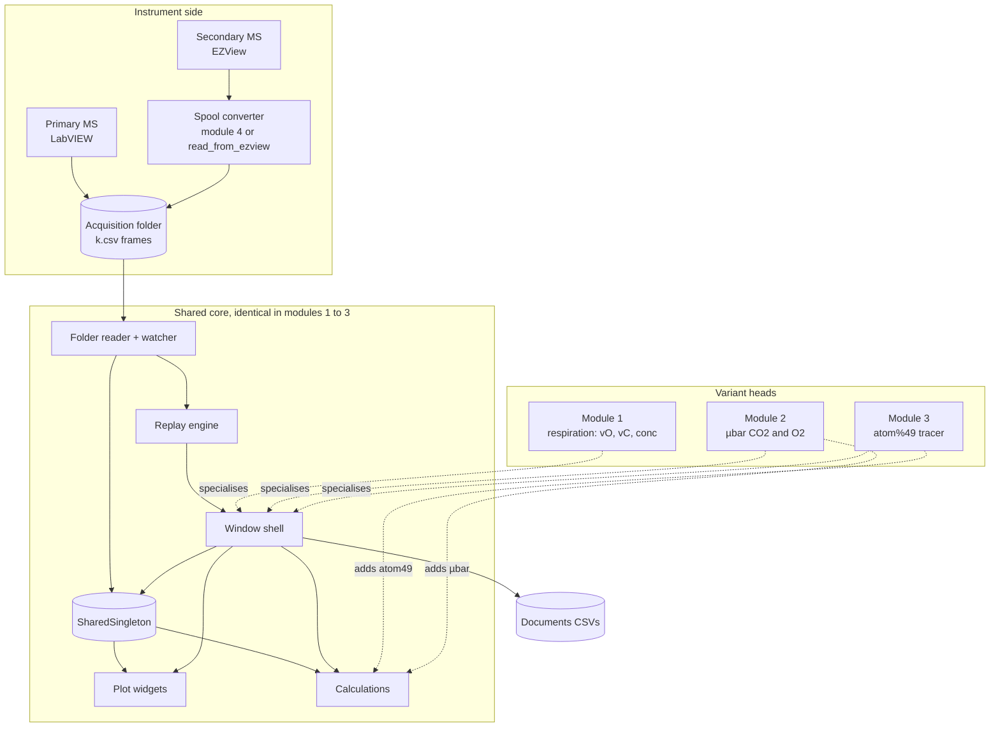

Figure 8.1 The heads are not separate code units; they are the parts of `main.py` and `Calculations.py` that differ between the three copies.

## 9. Onboarding views

### 9.1 Use cases

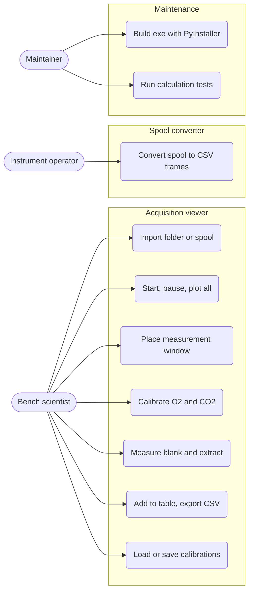

### 9.2 Deployment

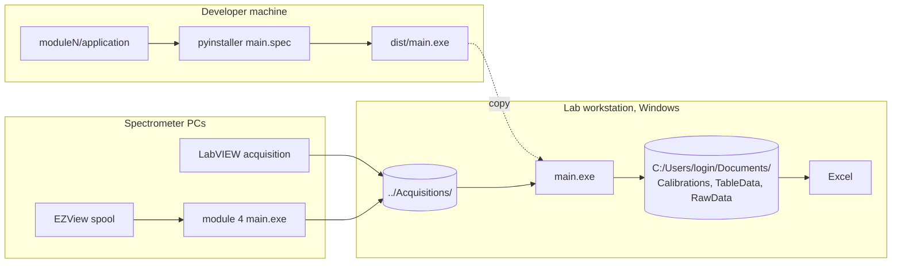

### 9.3 Repository map

```
cousins-lab-tools/
├── README.md                        run instructions, pip install per module
├── documentation/                   reports, minutes, sprint reports (no code)
├── module1/
│   ├── application/
│   │   ├── mainUI/main.py           LabView window, 2,452 lines
│   │   ├── mainUI/{worker,plotAllThread,newFileNotifierThread,stopwatch}.py
│   │   ├── read-data/{getData,file,dataUtility,sharedSingleton,readEZView}.py
│   │   ├── uiElements/{curve,graph,frame,button,dialog,LineEdit}.py
│   │   ├── calculations/Calculations.py
│   │   ├── ui/*.ui                  Qt Designer files, bundled, not loaded
│   │   ├── main.spec                PyInstaller
│   │   └── requirements.txt
│   └── testing/calculationTest.py   unittest: calibration, slope, intercept
├── module2/application/…            copy of module1 plus µbar calculations
├── module3/
│   ├── application/…                copy of module1 plus atom49 calculations
│   ├── main.py                      stale merged variant, do not edit
│   └── testing/Acquisition 4336 Mockup.xlsx
├── module4/application/main.py      141-line spool to CSV script
└── module{2,3,4}/SampleData.zip     sample acquisition folders
```

### 9.4 Glossary

Glossary

| Term | Meaning |
| --- | --- |
| frame | One acquisition tick: a timestamp and eight channel voltages; one CSV file |
| m32 … m49 | Mass-to-charge channels. m32 is O2; m44–m49 are CO2 isotopologues used for tracer work |
| mean bars | Two-handle region on the raw plot; every reading is a statistic over frames inside it |
| zero | Mean mV of a channel with no analyte; subtracted before scaling |
| calibration | Scale from mV to physical units, from known injections (µL CO2) or O2 solubility at a temperature |
| blank / extract | Slope of m44 and m32 over the window without and with the sample; the difference is net consumption |
| vO, vC | O2 and CO2 velocities: net rate × calibration, sign flipped so consumption is positive |
| µbar | Partial pressure unit used by module 2: %CO2 × 9200 |
| atom%49 | Module 3 tracer ratio 100 · m49 / (m45 + m47 + m49), plotted as ln so the rate is a slope |
| Plot All | Drain every remaining frame at once instead of replaying at recorded speed |

### 9.5 Risk register

Risk register

| Sev | Issue | Location | Effect |
| --- | --- | --- | --- |
| High | Three near-identical copies of the viewer; fixes must be applied three times | `module{1,2,3}/application` | Already diverged: frame height, Calculations signatures, curve store |
| High | Cubic sign flipped in O2 air solubility | module3 `calculateO2Air` | Wrong O2 calibration in module 3 |
| High | fileList appended from the watchdog thread and read from the QThread with no lock | `NewFileHandler`, `GetData.__next__` | Possible missed or reordered frame |
| Med | Output paths hard-coded to Windows Documents; raw export path missing a separator | `saveCalibrations`, `tableFileSave`, `exportRawData` | Non-Windows fails; raw export lands at Documents\\RawData\<folder>Data.csv |
| Med | Several methods defined twice in main.py; the later one wins | module1 `main.py` | Edits to the first copy have no effect |
| Med | `application_state == "Out_Of_Data"` comparison instead of assignment | `plotAllThread.py` | No-op; caller sets state so it works by accident |
| Med | getMean walks keys until one exceeds xright; if xright ≥ last key it raises IndexError | `Calculations.getMean` | Reachable whenever the right bar is at or beyond the last plotted point, since snapping can land on the last key |
| Med | Plot All sets state to Out_Of_Data unconditionally, after starting the thread that checks for Idle | module1 `plotAllButtonPressed` | Race on the Idle check; Start then allowed with no folder selected |
| Low | Only Calculations has tests | `testing/` | Reader and pacing regressions go unnoticed |
| Low | Debug prints in the per-frame path | module2 `update_main_plot_data` | Console noise |
| Low | Stale `module3/main.py` at module root | `module3/main.py` | Easy to edit the wrong file |
